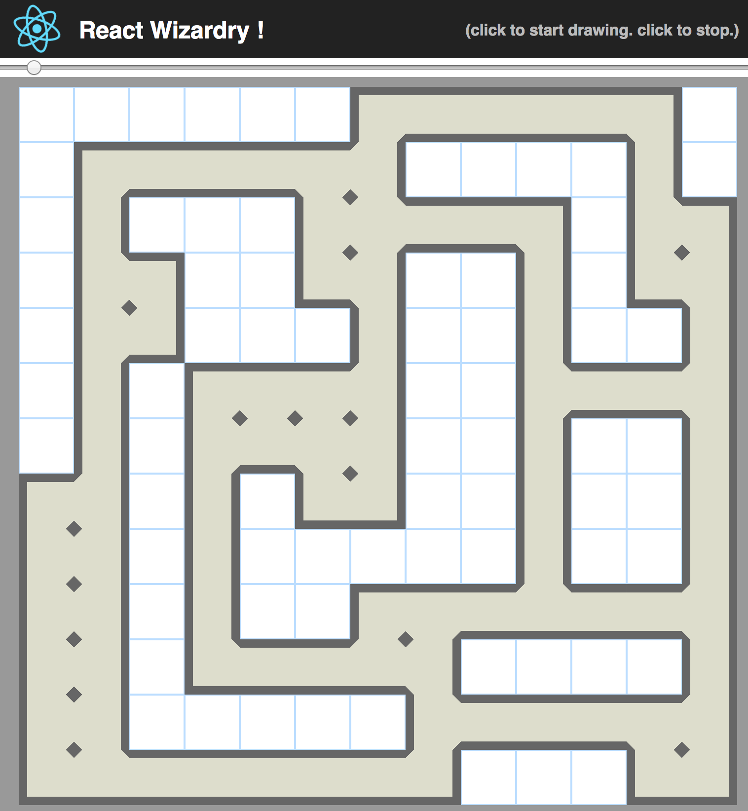

## React Wizardry !

This is an educational playground to try a few things with React. The hope is to create a basic map maker tool and then be able to move through the map in 3D (ToDo) to try it out. 

## Made with

- [x] [create-react-app](https://github.com/facebookincubator/create-react-app)
- [x] [React](https://facebook.github.io/react/)
- [x] [Redux](http://redux.js.org/)
- [x] A few interesting CSS tricks
- [x] Love

